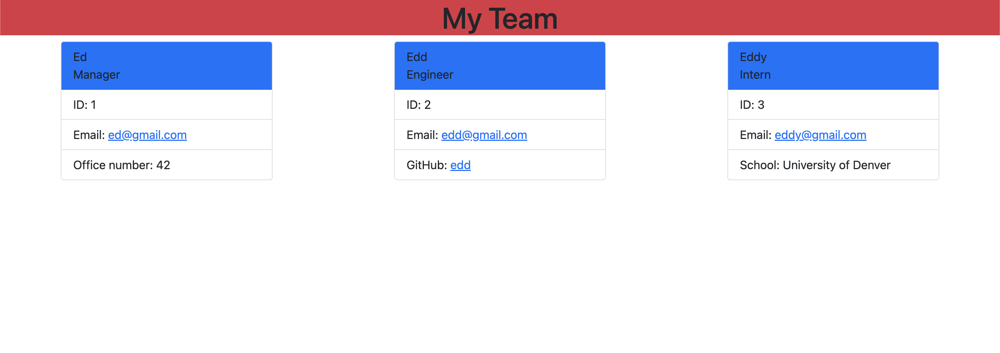

# Team_Profile_Generator

## Description

An application that generaters an HTML filethat add members of a team.

## Table of Contents

- [Description](#description)
- [Installation](#installation)
- [Usage](#usage)
- [License](#license)
- [Contributing](#contributing)
- [Tests](#tests)
- [Questions](#questions)

## Image preview

## Link to demo video

https://drive.google.com/file/d/1UIkQrQcmmZY413mZmG3BWwn3ENqoWQse/view

## Installation

Clone repository to your machine install inquirer, and emaill validation npms

## Usage

run node index.js in clone directory.

## License

This application is covered by the MIT license.

## Contributing

Peter Vrutneski

## Tests

Yes

## Questions

Find me on GitHub: [Boopdid](https://github.com/Boopdid)

Email me with any questions: pvrutneski@gmail.com
